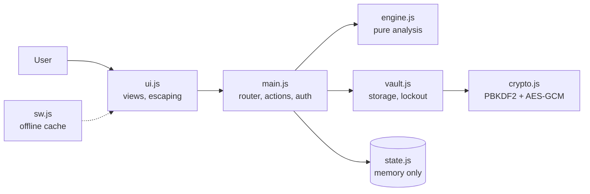

# Catchup: What Did I Miss?

A local-first micro-app that turns an overwhelming unread group chat into a short, prioritized digest. Built for the challenge **"The Unread Problem: What Did I Miss?"**

**Live demo:** https://srujansushma8-glitch.github.io/catchup/ (click **Explore with demo data**, no sign-in needed)

## The problem
After a few hours away, a group chat has hundreds of messages. A deadline change, a decision, and a task assigned to you are buried under small talk.

## What Catchup does
| Challenge requirement | How it is met |
|---|---|
| Summarize long unread conversations | One-line digest, "Attention split" chart, and a ranked list sized to your time budget (30 s, 2 min, 10 min) |
| Identify important messages, decisions, action items | Dedicated tabs: Triage, Decisions, Action items, Unkept promises |
| Prioritize by urgency and relevance | Transparent score from mentions, urgent wording, deadline proximity, unanswered questions, noise penalty. Every card shows its reasons |
| Highlight mentions, deadlines, missed tasks | @mentions and nicknames, date resolution ("Saturday 5pm", "12th"), "passed while you were away" flags, Reply queue with suggested replies |
| Local-first, nothing leaves the device | No server, no analytics, no third-party requests. CSP is `connect-src 'none'`. A live counter and a self-audit page prove it |

### Original ideas
- **Time-away window**: analyze only the last 24 hours or 3 days before the final message.
- **Reply queue**: questions waiting on you, with a suggested reply.
- **Unkept promises**: "I'll send it tonight" with no follow-up.
- **Hinglish and Kannada time words**: kal, aaj, parso, naale, indu.
- **Live self-audit** ("How it's built" page): CSP, network count, encryption at rest, offline support, engine self-test.

## Architecture

- **engine.js**: pure functions (`parse`, `deadline`, `analyze`). No DOM, no storage, so it is fully unit tested in Node.
- **crypto.js / vault.js**: key derivation, encryption, persistence, brute-force lockout.
- **ui.js**: rendering. Every dynamic value is HTML-escaped. No inline scripts or styles.
- **main.js / state.js**: single in-memory state object, routing, actions, sign-in, idle lock.
- See `docs/ARCHITECTURE.md` for design decisions.

## Security
- Passcode -> PBKDF2-SHA256 (600,000 rounds) -> AES-256-GCM key. The key lives in memory only.
- Chats and settings are stored encrypted. Raw exports are never displayed and message text is blurred by default.
- 5 wrong passcodes trigger a growing lockout. Auto-lock after 5 minutes idle.
- Strict CSP, `no-referrer`, no CDNs, no web fonts, uploads limited to `.txt` under 5 MB.
- Full notes and honest limits: `SECURITY.md`.

## Run, test, deploy
```bash
npm test          # 12 unit tests (Node 22+), no dependencies to install
npm start         # serves http://localhost:8080
```
Deploy: push this folder to GitHub, then Settings -> Pages -> Deploy from branch `main` / root. (ES modules need http(s), not `file://`.)

## Honest limitations
- Scoring uses transparent rules, not a language model, so unusual phrasing can be missed.
- The profile is local to one browser. There is no account recovery by design.
- Only the WhatsApp text export format is parsed today.

## Roadmap
Telegram JSON import, optional on-device LLM summary (WebLLM) for richer wording, export of action items to calendar (.ics).

License: MIT
